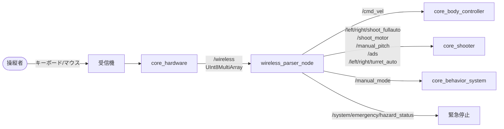
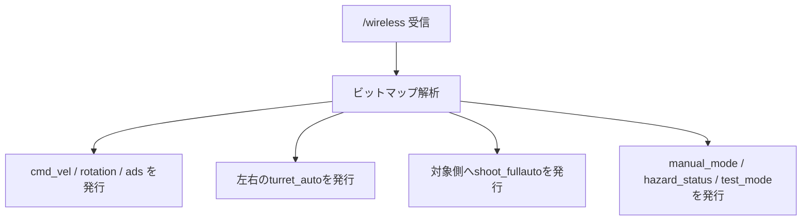

ワイヤレスコントローラの生入力を解析し、車体移動・タレット照準・射撃のROSトピックに変換するパッケージです。手動操縦の入口にあたります。

## 位置づけ

ハードウェアから届く生バイト列と、各制御ノードが期待するROSトピックの間を埋める変換層です。



## ノード一覧

| ノード | 実行ファイル | 役割 |
|-------|------------|------|
| [`wireless_parser_node`](wireless_parser_node.md) | `wireless_parser_node` | ワイヤレス入力のビット解析とトピック変換 |

## 入力の処理



左右のタレット自動制御フラグは独立して発行されます。互換用の `/manual_mode` は、`manual_mode_target_side` で指定した側の自動制御フラグを反転した値です。射撃トリガーも同じ対象側の `shoot_fullauto` に発行されます。

## 入力フォーマット

`/wireless` は7バイト以上のペイロードを持ち、byte 0の操作フラグ、byte 1/2のマウス入力、byte 3の移動・回転フラグとして解釈されます。

```
byte:  0        1        2        3         4        5        6
      [flags] [mouse_x][mouse_y][movement][reserved][reserved][reserved]
       │         │        │        │
       │         │        │        └─ WASD / InfiniteRotate
       │         │        └─ 符号付きマウスY
       │         └─ 符号付きマウスX
       └─ EStop / Roller / Reload / Shoot / ADS / 左右TurretAuto
```

ビットの詳細な割り当ては[ノードページ](wireless_parser_node.md#input-format)を参照してください。

## 起動

```bash
ros2 launch core_ros_player_controller wireless_parser_node.launch.py
```

設定ファイル: `config/wireless_parser_params.yaml`
