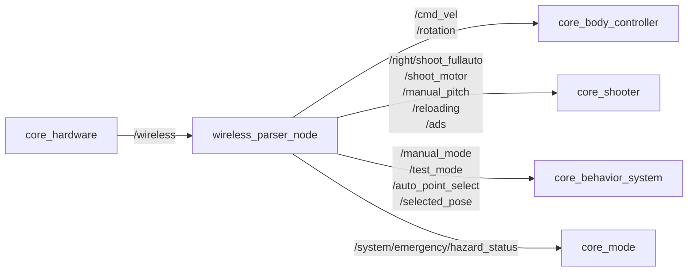

# wireless_parser_node

## Purpose

ワイヤレス受信機から届く生バイト列（`std_msgs/UInt8MultiArray`）は、そのままではROS側の制御ノードが解釈できません。このパッケージは生入力をビットマップとして解析し、車体移動・タレット照準・射撃といった意味のあるROSトピックへ変換する、手動操縦の入口となるノードを提供します。

## Inner-workings / Algorithms

`/wireless` を受信するたびに、先頭7バイト以上のペイロードをビットフィールドとして解釈し、対応するトピックを発行します。

`ui_flags` の自動フラグ（bit 1）がONの場合、`/cmd_vel` などの操縦系トピックは発行されません。自律走行中に手動入力が競合して車体が二重制御されるのを防ぐためのゲートです。一方 `/manual_mode` や `/system/emergency/hazard_status` は自律・手動を問わず常に発行されます。

`/reloading` は立ち上がりエッジでのみ発行され、ボタン押下中に連続発火しないようになっています。



### 入力フォーマット

`[flags, mouse_x, mouse_y, ui_flags, flags_2, ...]`

#### flags ビットマップ（byte 0）

| ビット | キー | 説明 |
|--------|------|------|
| 0 | Space | 緊急停止 |
| 1 | W | 前進 |
| 2 | S | 後退 |
| 3 | A | 左移動 |
| 4 | D | 右移動 |
| 5 | Reload | リロード |
| 6 | Click | 射撃トリガー |
| 7 | Roller | シューターモーター |

#### flags_2 ビットマップ（byte 4）

| ビット | キー | 説明 |
|--------|------|------|
| 0 | ADS | ADS（照準器を覗く）モード |
| 1 | Rotation | 車体回転モード切替 |

#### ui_flags ビットマップ（byte 3）

| ビット | 説明 |
|--------|------|
| 0 | ロックフラグ |
| 1 | 自動フラグ（ON時はcmd_vel等をパブリッシュしない） |

## Inputs / Outputs

### Input

| トピック | 型 | 説明 |
|---------|------|------|
| `/wireless` | `std_msgs/UInt8MultiArray` | ワイヤレス入力（7バイト以上） |

### Output

UI自動フラグがOFFの場合のみパブリッシュされるトピック（手動操作時）:

| トピック | 型 | 説明 |
|---------|------|------|
| `/cmd_vel` | `geometry_msgs/Twist` | 車体速度指令（linear.x=W/S, linear.y=A/D, angular.z=mouse_x） |
| `/rotation` | `std_msgs/Int32` | 車体回転モード |
| `/ads` | `std_msgs/Bool` | ADSモード |
| `/manual_pitch` | `std_msgs/Float32` | 手動ピッチ入力（mouse_y） |
| `/shoot_motor` | `std_msgs/Bool` | シューターローラーモーター制御 |
| `/right/shoot_fullauto` | `std_msgs/Bool` | 射撃トリガー（右タレット固定） |

`/reloading` は自動フラグOFFかつリロードキーの立ち上がりエッジでのみ発行されます。

| トピック | 型 | 説明 |
|---------|------|------|
| `/reloading` | `std_msgs/Bool` | マガジンリロードトリガー |

UI自動フラグがONの場合のみパブリッシュされるトピック（自律走行時）:

| トピック | 型 | 説明 |
|---------|------|------|
| `/auto_point_select` | `std_msgs/Bool` | 自動地点選択の有効/無効 |
| `/selected_pose` | `geometry_msgs/PoseStamped` | 操縦UIで指定された移動先（`map` フレーム。座標変化時のみ発行） |

常にパブリッシュされるトピック:

| トピック | 型 | 説明 |
|---------|------|------|
| `/manual_mode` | `std_msgs/Bool` | シューター手動照準モード（UI自動フラグの反転） |
| `/test_mode` | `std_msgs/Bool` | テストモード（常に `false`） |
| `/system/emergency/hazard_status` | `std_msgs/Bool` | 緊急停止状態 |

## Parameters

設定ファイル: `config/wireless_parser_params.yaml`

| パラメータ | デフォルト | 説明 |
|-----------|-----------|------|
| `mouse_x_sensitivity` | `1.0` | 水平マウス感度 |
| `mouse_y_sensitivity` | `1.0` | 垂直マウス感度 |
| `mouse_x_inverse` | `false` | 水平マウス方向反転 |
| `mouse_y_inverse` | `false` | 垂直マウス方向反転 |
| `cmd_vel_xy_scale` | `1.0` | WASD速度指令スケール係数 |

## Assumptions / Known limits

- `/wireless` のペイロードが7バイト未満の場合、そのメッセージは解釈できません。受信機側のフォーマット変更時はビットマップ定義の同期が必要です。
- 入力が途絶えてもこのノードはゼロ速度を発行しません。通信断の検知は [core_mode](../core_mode/index.md) の `diagnostic` ノードが `/wireless` のハートビート監視で担当します。
- `/test_mode` は常に `false` を発行します。テストモードを使う場合は本ノードを起動せず、`shooter_debug_topic_gui` などから直接発行してください。
- 射撃トリガーの発行先は `/right/shoot_fullauto` に固定されています。左タレットの射撃はこのノードからは発行されません。実装上のパブリッシャ変数名は `shoot_once_publisher_` ですが、発行先はフルオート用トピックです。
- `/reloading` はルート名前空間に発行されます。一方 [magazine_manager](../core_shooter/magazine_manager.md) は `left/` `right/` 名前空間内で `reloading` を購読するため（`/left/reloading`）、既定のランチ構成では直接つながりません。接続にはリマップが必要です。

## 起動

```bash
ros2 launch core_ros_player_controller wireless_parser_node.launch.py
```
