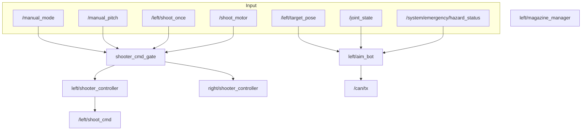

# core_shooter

左右タレットの射撃・照準・マガジン管理を行うシューターパッケージです。

## 概要

デュアルタレット構成で、各タレットが独立した照準（aim_bot）、射撃制御（shooter_controller）、マガジン管理（magazine_manager）を持ちます。ビジョンによる自動追尾と手動照準の両モードに対応します。



## ノード

### shooter_cmd_gate

射撃コマンドのゲート。手動/自動制御を左右タレットに振り分けます。

### shooter_controller（左右各1）

シューターモーターとローディング機構を制御。単発・バースト・フルオートモードに対応。ジャム検出機能あり。

### magazine_manager（左右各1）

ディスクマガジンの管理。高さセンサでディスク数を推定し、リグリップ機能を提供します。

### aim_bot（左右各1）

ビジョンベースのターゲット追尾。ゾーン別角度制限、手動モード時の固定角度制御に対応します。

## 入力

| トピック | 型 | 説明 |
|---------|------|------|
| `shoot_once` | `std_msgs/Bool` | 単発射撃コマンド |
| `shoot_burst` | `std_msgs/Bool` | バースト射撃コマンド |
| `shoot_fullauto` | `std_msgs/Bool` | フルオート射撃コマンド |
| `manual_mode` | `std_msgs/Bool` | 手動照準モード切替 |
| `manual_pitch` | `std_msgs/Float32` | 手動ピッチ入力 [-1.0〜1.0] |
| `shoot_motor_state` | `std_msgs/Bool` | シューターモーター状態 |
| `joint_state` | `sensor_msgs/JointState` | モーター関節状態フィードバック |
| `damage_panel_pose` | `geometry_msgs/PointStamped` | ビジョンからのターゲット検出 |
| `/system/emergency/hazard_status` | `std_msgs/Bool` | 緊急停止信号 |
| `distance` | `sensor_msgs/Range` | マガジン充填高さセンサ |

## 出力

| トピック | 型 | 説明 |
|---------|------|------|
| `shoot_cmd` | `std_msgs/Int32` | 射撃コマンド（CAN経由） |
| `shoot_motor` | `std_msgs/Float32` | シューターモーター指令 |
| `manual_mode` | `std_msgs/Bool` | 手動モード状態（左右別） |

## パラメータ

設定ファイル: `config/shooter.params.yaml`

### ShooterController

| パラメータ | デフォルト | 説明 |
|-----------|-----------|------|
| `shoot_motor_id` | `15`/`16` | シューターモーターCAN ID（左/右） |
| `loading_motor_id` | `12`/`8` | ローディングモーターCAN ID（左/右） |
| `burst_count` | `3` | バーストモードの発数 |
| `shoot_interval_ms` | `500` | 単発射撃間隔 [ms] |
| `burst_interval_ms` | `500` | バースト射撃間隔 [ms] |
| `fullauto_interval_ms` | `500` | フルオート射撃間隔 [ms] |
| `loading_motor_speed` | `6.5` | ローディングモーター速度 [rev/s] |
| `target_speed` | `[2000, 1750, 1500]` | シューターモーター目標速度 |
| `enable_jam_detection` | `false` | ジャム検出有効化 |

### MagazineManager

| パラメータ | デフォルト | 説明 |
|-----------|-----------|------|
| `max_disks` | `30` | 最大ディスク容量 |
| `disk_thickness` | `20.0` | ディスク厚さ [mm] |
| `sensor_height` | `500.0` | センサ高さ [mm] |
| `regrip_enabled` | `true` | リグリップ機能有効化 |
| `regrip_release_ms` | `1000` | リグリップ保持時間 [ms] |

### AimBot

| パラメータ | デフォルト | 説明 |
|-----------|-----------|------|
| `pitch_motor_id` | `11`/`7` | ピッチモーターCAN ID（左/右） |
| `yaw_motor_id` | `5`/`6` | ヨーモーターCAN ID（左/右） |
| `rate` | `30.0` | 更新レート [Hz] |
| `horizontal_fov_deg` | `100.0` | 水平視野角 [deg] |
| `yaw_image_gain` | `0.0005` | ヨー画像追尾ゲイン |
| `pitch_image_gain` | `0.0005` | ピッチ画像追尾ゲイン |
| `target_timeout_sec` | `0.2` | ターゲット検出タイムアウト [s] |
| `enable_zone_angle_limit` | `true` | ゾーン別角度制限有効化 |

## 起動

```bash
ros2 launch core_shooter shooter.launch.py
```

!!! note "タレット構成"
    左右タレットはそれぞれ `left/`、`right/` 名前空間で起動されます。モーターIDはランチファイルで左右別に設定されます。
