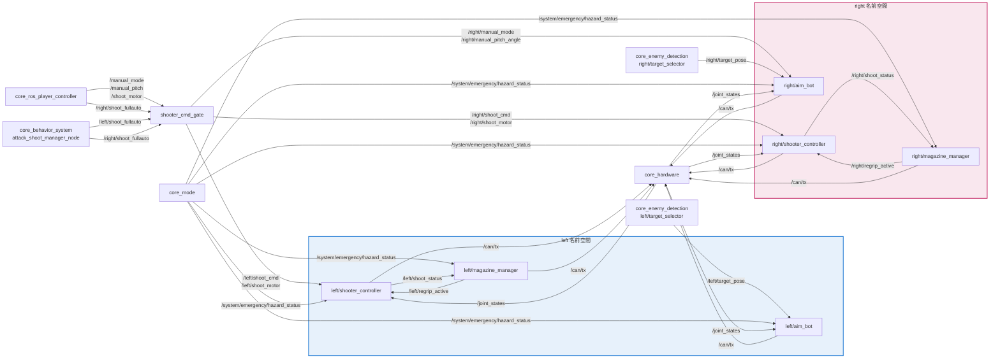

# core_shooter

左右タレットの射撃・照準・マガジン管理を行うシューターパッケージです。デュアルタレット構成で、各タレットが独立した照準・射撃制御・マガジン管理を持ち、ビジョンによる自動追尾と手動照準の両モードに対応します。

## ノード一覧

| ノード | 役割 |
|-------|------|
| [`shooter_cmd_gate`](shooter_cmd_gate.md) | 射撃コマンドのゲート。単発/バースト/フルオートを左右タレットの数値コマンドに変換 |
| [`shooter_controller`](shooter_controller.md) | シューターモーターとローディング機構の制御（左右各1）。ジャム検出を含む |
| [`magazine_manager`](magazine_manager.md) | ディスクマガジンの残弾推定とリグリップ制御（左右各1） |
| [`aim_bot`](aim_bot.md) | ビジョンベースのターゲット追尾とヨー/ピッチ制御（左右各1） |
| [`shooter_debug_topic_gui`](shooter_debug_topic_gui.md) | 実機なしで各トピックを操作・監視するデバッグGUI |

## データフロー

左右のタレットは同じ3ノード構成（`shooter_controller` / `magazine_manager` / `aim_bot`）を持ちますが、手動操縦系の入力は右タレット固定という非対称があるため、図では左右を分けて示します。



`shooter_cmd_gate` が操縦入力を左右に振り分け、各タレットの `shooter_controller` が射撃機構を、`aim_bot` が砲身姿勢を、`magazine_manager` が装填を担当します。6ノードとも最終的な指令は `/can/tx` に集約され、[core_hardware](../core_hardware/index.md) がEtherCAT経由でモータに送出します。

`shooter_cmd_gate` のみ名前空間の外（ルート）に起動され、左右両方の入出力を扱います。タレット側の3ノードは `left/` `right/` 名前空間に入るため、ノード内の相対トピック名がそのまま `/left/...` `/right/...` に解決されます。

!!! note "左右の非対称"
    - **手動操縦からの射撃トリガーは右固定**: [wireless_parser_node](../core_ros_player_controller/wireless_parser_node.md) は射撃入力を `/right/shoot_fullauto` にのみ発行します（図中の `Player --> Gate`）。左タレットの単発・バースト射撃は手動操縦からは発行されません。
    - **手動照準の対象は右固定（デフォルト）**: `shooter_cmd_gate` の `manual_mode_target_side` パラメータで指定した側にのみ `manual_mode` / `manual_pitch_angle` を転送します。デフォルトは `right` のため図もそれに合わせています。パラメータを変更すれば左側に転送先を変えられます。
    - **モーターIDとゾーン制限値**: シューター・ローディング・ヨー・ピッチ・ホールドの各モーターIDと、`aim_bot` のゾーン別角度制限は左右で別の値がランチファイルから与えられます（下表参照）。

!!! note "今回未使用の入力"
    `magazine_manager` はマガジン充填高さセンサ（`{side}/distance`）とディスクホールドの手動オーバーライド（`{side}/disk_hold_state`）を購読できますが、実機でこれらを発行する構成が今回はないため上図には含めていません。残弾管理・ホールド制御は発射カウントのみで自律的に行われます。詳細は[magazine_managerの残弾推定](magazine_manager.md#残弾推定)を参照してください。

## ノード構成と名前空間

左右タレットはそれぞれ `left/`、`right/` 名前空間で起動されます。`{side}` は `left` / `right` のいずれかを表します。

| 実行ファイル | 起動ノード名 | 名前空間 |
|------------|-------------|---------|
| `shooter_cmd_gate` | `shooter_cmd_gate` | （なし・ルート） |
| `shooter_controller` | `{side}_shooter_controller` | `/{side}` |
| `magazine_manager` | `{side}_magazine_manager` | `/{side}` |
| `aim_bot` | `{side}_aim_bot` | `/{side}` |

左右で異なるモーターIDの割り当ては次のとおりです。

| モーター | left | right |
|---------|------|-------|
| シューター（ESC） | 15 | 16 |
| ローディング | 12 | 8 |
| ヨー | 5 | 6 |
| ピッチ | 11 | 7 |
| ディスクホールド（左/右） | 14 / 13 | 10 / 9 |

## 起動

```bash
ros2 launch core_shooter shooter.launch.py
```

設定ファイル: `config/shooter.params.yaml`
