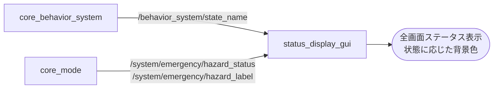

# core_status_gui

ロボットの行動状態と緊急停止状態を、離れた場所からでも一目で判別できる大画面表示にするパッケージです。ピット作業や試合中の状況確認に使用します。

## 構成

情報の発生源は [core_behavior_system](../core_behavior_system/index.md)（行動状態）と [core_mode](../core_mode/index.md)（緊急状態）の2系統で、それらを1つの画面に集約します。



[core_qt_gui](../core_qt_gui/index.md) が操縦者向けの詳細なHUDであるのに対し、こちらは離れた位置から状態だけを確認するための単機能なサブディスプレイという位置づけです。

## ノード一覧

| ノード | 役割 |
|-------|------|
| [`status_display_gui`](status_display_gui.md) | 行動状態と緊急状態を全画面表示するTkinter製GUI |

## 表示の考え方

状態ごとに背景色を割り当てているため、文字を読まなくても色だけで状況が分かります。

| 状態 | 背景色 | 用途 |
|------|-------|------|
| 緊急停止 | 赤 `#b30d0d` | 最優先。他の状態を上書きして表示 |
| `ATTACK` | オレンジ `#c78100` | 交戦中 |
| `MANUAL` | グレー `#5f6773` | 手動操縦中 |
| `AUTO_SELECTED` | 緑 `#1f8a4c` | 指定地点へ移動中 |
| `AUTO_WAYPOINT` | シアン `#2cacc9` | 巡回中 |
| `AUTO_IDLE` | 濃紺 `#24415f` | 自律待機中 |
| 未知の状態 | 既定色 `#173a63` | 上記以外 |

## 起動

```bash
# ウィンドウモード（デフォルト）
ros2 launch core_status_gui status_display_gui.launch.py

# 全画面表示
ros2 launch core_status_gui status_display_gui.launch.py fullscreen:=true
```

Pythonパッケージのため、`colcon build` 後は `--symlink-install` を使っているとソース変更が即座に反映されます。
