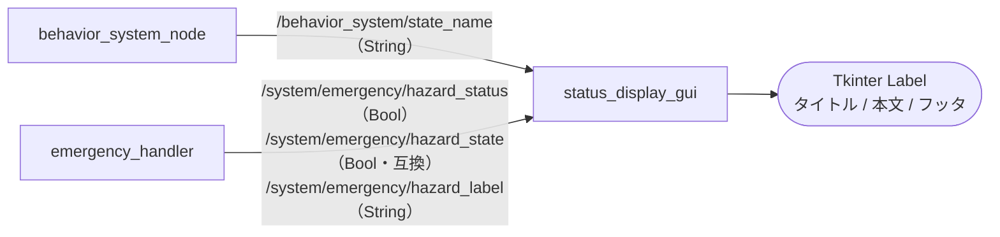

# status_display_gui

## Purpose

ロボットが今どの行動状態にあり、緊急停止がかかっているかどうかは、ピットや観戦位置から即座に判断したい情報です。このノードはその2点だけを大きな文字と色で全画面表示し、ターミナルを覗き込まずに状況を把握できるようにします。

## Inner-workings / Algorithms

TkinterのGUIループとROS2のスピンを併存させ、`POLL_INTERVAL_MS`（100ms）ごとに受信データを画面へ反映します。



### 表示の決定ロジック

1. 緊急停止（`hazard_status`）が `true` なら、行動状態に関わらず緊急スタイル（赤背景）を適用し、`hazard_label` から得た停止理由を表示
2. そうでなければ、`state_name` に対応する背景色・前景色を `BEHAVIOR_STYLES` から選択
3. 未知の状態名の場合は既定スタイル（`#173a63`）を使用

停止理由のラベルは長い文字列で届くため、`HAZARD_REASON_ALIASES` により表示用の短い語（例: `EMERGENCY SWITCH TRIGGERED` → `E-STOP`）に置き換えてから描画します。

### QoS の二重購読

緊急状態のトピックは `transient_local`（latched）と通常（live）の両方のQoSで購読します。発行側の設定がどちらであっても取りこぼさないための互換対応です。同じ理由で、`hazard_status` に加えて旧トピック名 `hazard_state` も購読できるようになっています。

### 全画面表示

`fullscreen` が有効な場合、Tkinterの全画面属性を設定します。ウィンドウマネージャが対応していない場合は例外を捕捉し、警告を出したうえでウィンドウモードにフォールバックします。

## Inputs / Outputs

### Input

| トピック | 型 | QoS | 説明 |
|---------|------|-----|------|
| `/behavior_system/state_name` | `std_msgs/String` | reliable(10) | 行動状態の名前 |
| `/system/emergency/hazard_status` | `std_msgs/Bool` | latched + live | 緊急停止状態 |
| `/system/emergency/hazard_state` | `std_msgs/Bool` | latched + live | 緊急停止状態（旧トピック名の互換） |
| `/system/emergency/hazard_label` | `std_msgs/String` | latched + live | 緊急停止の理由ラベル |

### Output

トピックの発行はありません。出力は画面表示のみです。

## Parameters

| パラメータ | 型 | デフォルト | 説明 |
|-----------|------|-----------|------|
| `behavior_topic` | string | `/behavior_system/state_name` | 行動状態トピック名 |
| `hazard_status_topic` | string | `/system/emergency/hazard_status` | 緊急停止トピック名 |
| `hazard_status_compat_topic` | string | `/system/emergency/hazard_state` | 互換用の緊急停止トピック名 |
| `hazard_state_topic` | string | `""` | 追加の緊急停止トピック（空で無効） |
| `hazard_state_compat_topic` | string | `""` | 追加の互換トピック（空で無効） |
| `hazard_label_topic` | string | `/system/emergency/hazard_label` | 緊急停止の理由ラベルトピック名 |
| `fullscreen` | bool | `true`（launchでは `false`） | 全画面表示 |
| `screen_index` | int | `0` | 表示するディスプレイ番号 |
| `window_title` | string | `ROS Status Display` | ウィンドウタイトル |

!!! note "fullscreen のデフォルト値"
    ノード側の宣言は `true` ですが、`status_display_gui.launch.py` は `false` を渡します。ランチ経由ではウィンドウモードが既定です。

## Assumptions / Known limits

- Tkinterが利用可能なGUI環境が必要です。ヘッドレス環境では起動できません。
- 表示するのは行動状態と緊急状態のみです。HP・残弾・映像などは扱いません。それらが必要な場合は [core_qt_gui](../core_qt_gui/index.md) を使用してください。
- 行動状態のスタイルは `BEHAVIOR_STYLES` にハードコードされています。[core_behavior_system](../core_behavior_system/index.md) に新しい状態を追加した場合、このノードでは既定色で表示されます。
- 状態名が届かない場合、直前の表示が残り続けます。上流ノードの停止を検知する仕組みはありません。
- `screen_index` によるマルチディスプレイ指定は、ウィンドウマネージャの対応状況に依存します。

## 起動

```bash
ros2 launch core_status_gui status_display_gui.launch.py fullscreen:=true
```

単体起動する場合:

```bash
ros2 run core_status_gui status_display_gui
```
