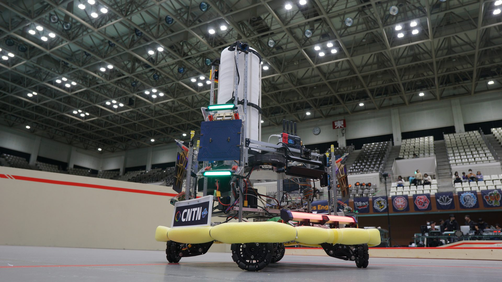
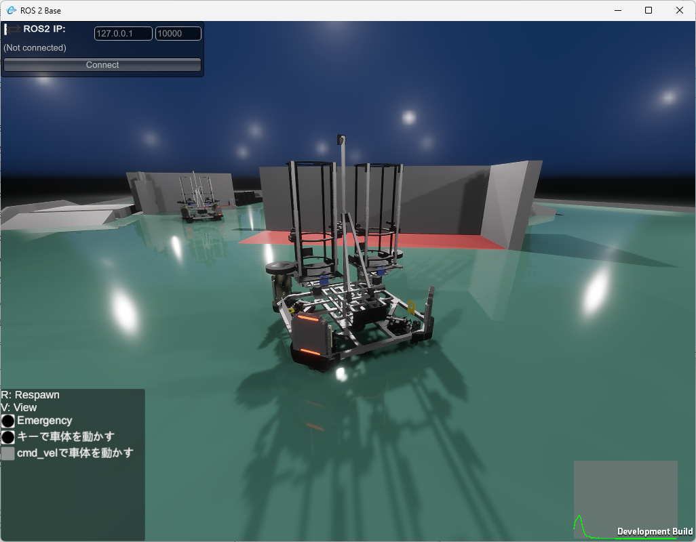

# 2026年度 機体コンセプト

## 0. コンセプト

> **かっこいい機体と派手な動きで観客を魅了し、技術的な面白さを追求しながら、魅せるだけでは終わらない、試合で勝ち切る機体を目指す**

2026年度は、観客を楽しませるかっこよさと派手な動き、技術的な面白さを追求します。
その一方で、かっこよさや面白さだけでは終わらせず、競技で勝利できる機体を目指しました。

### 今年の挑戦の2本柱

1. **自動化**
   自動照準・自律移動・シミュレーション環境の構築に取り組み、判断・照準・接敵を高速化を目指しました。
2. **昨年実証した防御力と、攻撃力の両立**
   昨年実証した回転機構による防御力を引き継ぎつつ、2砲門化によって攻撃力の強化を目指しました。

## 1. 設計思想――競技性能と、観客を楽しませる演出の両立

### 1.1 昨年度より挑戦的な技術課題に挑戦する

昨年度は、ロボットを大会に出場できる状態まで作り込みました。
今年度は自動化要素をさらに増やし、自律的に動くロボットを目指しました。

### 1.2 見ている人が惹かれる機体を目指す

制御の自動化は製作者にとって面白い一方、観客から見ると、その面白さが伝わりにくい要素でもあります。
私たちは、観客がひと目で**面白い・目立つ・ロボットらしい**と感じられることも重要だと考えています。
個別に動く砲塔などにより、見て分かる派手さや面白さを目指しました。

### 1.3 「かっこいい」でなく、試合でも強いを目指す

派手な動きを単なる演出で終わらせず、競技性能の向上の意味も持たせました。

- **自動化**：判断・照準・接敵の高速化
- **複数砲門化**：DPS・弾数・継戦力の向上

### 1.4 昨年から今年への発展

- **昨年**：無限回転による防御の有効性を示しました。また、回転により多くの人が興味を持てる機体となりました。

  

- **今年**：回転はそのままに、砲塔が独立して動く派手な動きと回転しながら独立して攻撃する防御 + 攻撃という実用性を兼ね備えた機体になりました。

  .JPG>)

## 2. 設計方針

### 2.1 メカ

<!-- 機動性、攻撃機構、重心、交換・整備のしやすさなどの方針を記述する。 -->

- 足回りの機構と、無限回転という基本方針は引き続き採用しました。
- 砲塔を小型化し、新たに2砲門構成を採用しました
- 各砲塔を独立して自動制御するため、Yaw・Pitchの2軸角度調節機構を搭載しました。

### 2.2 回路

<!-- 電源、通信、配線、保護、基板の共通化などの方針を記述する。 -->

- メイン基板とPC間の通信をEtherCATに変更しました。

### 2.3 ソフトウェア

<!-- 自律化、操縦支援、モジュール構成、シミュレーション活用などの方針を記述する。 -->

- 実機がなくてもソフトウェア開発を進められるよう、シミュレーション環境を整備しました。
- 下記の自律化を目指しました。完全無人化ではなく、操縦者を支援するための自動化を目指しました。
  - 自動照準：ダメージパネルを認識し、砲塔がYaw・Pitchの2軸で追従 → やや達成
  - 自律移動：周辺環境を認識し、ナビゲーションによって相手へ接近 → 未達成

